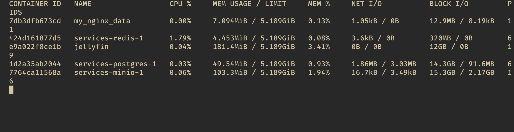

1. 

4. Docker logs
```bash
1:C 15 Oct 2024 12:19:56.031 * oO0OoO0OoO0Oo Redis is starting oO0OoO0OoO0Oo
1:C 15 Oct 2024 12:19:56.031 * Redis version=7.4.1, bits=64, commit=00000000, modified=0, pid=1, just started
1:C 15 Oct 2024 12:19:56.031 # Warning: no config file specified, using the default config. In order to specify a config file use redis-server /path/to/redis.conf
1:M 15 Oct 2024 12:19:56.031 * monotonic clock: POSIX clock_gettime
1:M 15 Oct 2024 12:19:56.032 * Running mode=standalone, port=6379.
1:M 15 Oct 2024 12:19:56.032 * Server initialized
1:M 15 Oct 2024 12:19:56.032 * Loading RDB produced by version 7.4.1
1:M 15 Oct 2024 12:19:56.032 * RDB age 1 seconds
1:M 15 Oct 2024 12:19:56.032 * RDB memory usage when created 0.98 Mb
1:M 15 Oct 2024 12:19:56.032 * Done loading RDB, keys loaded: 0, keys expired: 0.
1:M 15 Oct 2024 12:19:56.032 * DB loaded from disk: 0.000 seconds
1:M 15 Oct 2024 12:19:56.032 * Ready to accept connections tcp
1:M 15 Oct 2024 13:19:57.075 * 1 changes in 3600 seconds. Saving...
1:M 15 Oct 2024 13:19:57.091 * Background saving started by pid 22
22:C 15 Oct 2024 13:19:57.139 * DB saved on disk
22:C 15 Oct 2024 13:19:57.139 * Fork CoW for RDB: current 0 MB, peak 0 MB, average 0 MB
1:M 15 Oct 2024 13:19:57.198 * Background saving terminated with success
1:C 24 Oct 2024 12:35:40.082 * oO0OoO0OoO0Oo Redis is starting oO0OoO0OoO0Oo
1:C 24 Oct 2024 12:35:40.082 * Redis version=7.4.1, bits=64, commit=00000000, modified=0, pid=1, just started
1:C 24 Oct 2024 12:35:40.082 # Warning: no config file specified, using the default config. In order to specify a config file use redis-server /path/to/redis.conf
1:M 24 Oct 2024 12:35:40.083 * monotonic clock: POSIX clock_gettime
1:M 24 Oct 2024 12:35:40.084 * Running mode=standalone, port=6379.
1:M 24 Oct 2024 12:35:40.084 * Server initialized
1:M 24 Oct 2024 12:35:40.084 * Loading RDB produced by version 7.4.1
1:M 24 Oct 2024 12:35:40.084 * RDB age 774943 seconds
1:M 24 Oct 2024 12:35:40.084 * RDB memory usage when created 1.03 Mb
1:M 24 Oct 2024 12:35:40.084 * Done loading RDB, keys loaded: 2, keys expired: 0.
1:M 24 Oct 2024 12:35:40.084 * DB loaded from disk: 0.000 seconds
1:M 24 Oct 2024 12:35:40.084 * Ready to accept connections tcp
```


3. Docker inspect:

Не уверен что тут анализировать. Оно передает env, настройки сети, volumes и еще кучу всего.

```json
[
    {
        "Id": "424d161877d5a5bd639a0e9534e6a4598eb3f7ae3c87f37e44403c254daa1297",
        "Created": "2024-10-15T12:19:55.492879436Z",
        "Path": "docker-entrypoint.sh",
        "Args": [
            "redis-server"
        ],
        "State": {
            "Status": "running",
            "Running": true,
            "Paused": false,
            "Restarting": false,
            "OOMKilled": false,
            "Dead": false,
            "Pid": 1280,
            "ExitCode": 0,
            "Error": "",
            "StartedAt": "2024-10-24T12:35:39.985246441Z",
            "FinishedAt": "2024-10-24T12:35:32.279355542Z"
        },
        "Image": "sha256:bc7d9ed651b363f08c89a1b3087325f0137cb8fb9e61c7b4f6a08e67e7d2806a",
        "ResolvConfPath": "/var/lib/docker/containers/424d161877d5a5bd639a0e9534e6a4598eb3f7ae3c87f37e44403c254daa1297/resolv.conf",
        "HostnamePath": "/var/lib/docker/containers/424d161877d5a5bd639a0e9534e6a4598eb3f7ae3c87f37e44403c254daa1297/hostname",
        "HostsPath": "/var/lib/docker/containers/424d161877d5a5bd639a0e9534e6a4598eb3f7ae3c87f37e44403c254daa1297/hosts",
        "LogPath": "/var/lib/docker/containers/424d161877d5a5bd639a0e9534e6a4598eb3f7ae3c87f37e44403c254daa1297/424d161877d5a5bd639a0e9534e6a4598eb3f7ae3c87f37e44403c254daa1297-json.log",
        "Name": "/services-redis-1",
        "RestartCount": 0,
        "Driver": "overlay2",
        "Platform": "linux",
        "MountLabel": "",
        "ProcessLabel": "",
        "AppArmorProfile": "",
        "ExecIDs": null,
        "HostConfig": {
            "Binds": null,
            "ContainerIDFile": "",
            "LogConfig": {
                "Type": "json-file",
                "Config": {}
            },
            "NetworkMode": "services_default",
            "PortBindings": {
                "6379/tcp": [
                    {
                        "HostIp": "",
                        "HostPort": "6379"
                    }
                ]
            },
            "RestartPolicy": {
                "Name": "no",
                "MaximumRetryCount": 0
            },
            "AutoRemove": false,
            "VolumeDriver": "",
            "VolumesFrom": null,
            "ConsoleSize": [
                0,
                0
            ],
            "CapAdd": null,
            "CapDrop": null,
            "CgroupnsMode": "private",
            "Dns": [],
            "DnsOptions": [],
            "DnsSearch": [],
            "ExtraHosts": [],
            "GroupAdd": null,
            "IpcMode": "private",
            "Cgroup": "",
            "Links": null,
            "OomScoreAdj": 0,
            "PidMode": "",
            "Privileged": false,
            "PublishAllPorts": false,
            "ReadonlyRootfs": false,
            "SecurityOpt": null,
            "UTSMode": "",
            "UsernsMode": "",
            "ShmSize": 2785017856,
            "Runtime": "runc",
            "Isolation": "",
            "CpuShares": 0,
            "Memory": 0,
            "NanoCpus": 0,
            "CgroupParent": "",
            "BlkioWeight": 0,
            "BlkioWeightDevice": null,
            "BlkioDeviceReadBps": null,
            "BlkioDeviceWriteBps": null,
            "BlkioDeviceReadIOps": null,
            "BlkioDeviceWriteIOps": null,
            "CpuPeriod": 0,
            "CpuQuota": 0,
            "CpuRealtimePeriod": 0,
            "CpuRealtimeRuntime": 0,
            "CpusetCpus": "",
            "CpusetMems": "",
            "Devices": null,
            "DeviceCgroupRules": null,
            "DeviceRequests": null,
            "MemoryReservation": 0,
            "MemorySwap": 0,
            "MemorySwappiness": null,
            "OomKillDisable": null,
            "PidsLimit": null,
            "Ulimits": null,
            "CpuCount": 0,
            "CpuPercent": 0,
            "IOMaximumIOps": 0,
            "IOMaximumBandwidth": 0,
            "Mounts": [
                {
                    "Type": "volume",
                    "Source": "9b709b99491dfa6b5a12b0291ee0cd9e2ea0099c09674f665ade5cd92d6d578f",
                    "Target": "/data"
                }
            ],
            "MaskedPaths": [
                "/proc/asound",
                "/proc/acpi",
                "/proc/kcore",
                "/proc/keys",
                "/proc/latency_stats",
                "/proc/timer_list",
                "/proc/timer_stats",
                "/proc/sched_debug",
                "/proc/scsi",
                "/sys/firmware",
                "/sys/devices/virtual/powercap"
            ],
            "ReadonlyPaths": [
                "/proc/bus",
                "/proc/fs",
                "/proc/irq",
                "/proc/sys",
                "/proc/sysrq-trigger"
            ]
        },
        "GraphDriver": {
            "Data": {
                "LowerDir": "/var/lib/docker/overlay2/d12df2750e09d4f038ebd2183e24439a5c67388e81c28a5df123df675b034349-init/diff:/var/lib/docker/overlay2/08009dd98175db6bb4408071bfc74f3402890aa31a81a9927cf0a962c9e4ad48/diff:/var/lib/docker/overlay2/3d286d3be6f77e044428e12f02d3cbbabde6366ccc64ba4665894cdd8efb55e8/diff:/var/lib/docker/overlay2/6069287e9b2b70ac2a683930e5a7668bd162c4b81a46eb82c3287a1a8ccf3db9/diff:/var/lib/docker/overlay2/7578ff282f3c6a158dd339ce3033b1bfaa78a17b1213afec08aad357ff15c541/diff:/var/lib/docker/overlay2/dcd7e29d8ece9aff0681dddfc8f33325e79329706a89b52ab427555995cdcdf5/diff:/var/lib/docker/overlay2/00c1ed2f6418e7d869626c6b4f386895f4580e9252ea5bfbedc5cc320c1c758f/diff:/var/lib/docker/overlay2/e044ee00cebc478e8a35963e013b781e2ccae1ed1d47a5f2dd2632f8346a2614/diff:/var/lib/docker/overlay2/3acc9b9c8459d91066745e14ddd50b6c5fec8dc00d89e75acc500ffe069d310c/diff",
                "MergedDir": "/var/lib/docker/overlay2/d12df2750e09d4f038ebd2183e24439a5c67388e81c28a5df123df675b034349/merged",
                "UpperDir": "/var/lib/docker/overlay2/d12df2750e09d4f038ebd2183e24439a5c67388e81c28a5df123df675b034349/diff",
                "WorkDir": "/var/lib/docker/overlay2/d12df2750e09d4f038ebd2183e24439a5c67388e81c28a5df123df675b034349/work"
            },
            "Name": "overlay2"
        },
        "Mounts": [
            {
                "Type": "volume",
                "Name": "9b709b99491dfa6b5a12b0291ee0cd9e2ea0099c09674f665ade5cd92d6d578f",
                "Source": "/var/lib/docker/volumes/9b709b99491dfa6b5a12b0291ee0cd9e2ea0099c09674f665ade5cd92d6d578f/_data",
                "Destination": "/data",
                "Driver": "local",
                "Mode": "z",
                "RW": true,
                "Propagation": ""
            }
        ],
        "Config": {
            "Hostname": "424d161877d5",
            "Domainname": "",
            "User": "",
            "AttachStdin": false,
            "AttachStdout": true,
            "AttachStderr": true,
            "ExposedPorts": {
                "6379/tcp": {}
            },
            "Tty": false,
            "OpenStdin": false,
            "StdinOnce": false,
            "Env": [
                "REDIS_PASSWORD=password",
                "REDIS_USER=w1png",
                "REDIS_USER_PASSWORD=password",
                "PATH=/usr/local/sbin:/usr/local/bin:/usr/sbin:/usr/bin:/sbin:/bin",
                "GOSU_VERSION=1.17",
                "REDIS_VERSION=7.4.1",
                "REDIS_DOWNLOAD_URL=http://download.redis.io/releases/redis-7.4.1.tar.gz",
                "REDIS_DOWNLOAD_SHA=bc34b878eb89421bbfca6fa78752343bf37af312a09eb0fae47c9575977dfaa2"
            ],
            "Cmd": [
                "redis-server"
            ],
            "Image": "redis:latest",
            "Volumes": {
                "/data": {}
            },
            "WorkingDir": "/data",
            "Entrypoint": [
                "docker-entrypoint.sh"
            ],
            "OnBuild": null,
            "Labels": {
                "com.docker.compose.config-hash": "13b060fbcb4d24bb3f028fdbe4d5b4edc9ebe02747528f810ebf05a0ddf3dc38",
                "com.docker.compose.container-number": "1",
                "com.docker.compose.depends_on": "",
                "com.docker.compose.image": "sha256:bc7d9ed651b363f08c89a1b3087325f0137cb8fb9e61c7b4f6a08e67e7d2806a",
                "com.docker.compose.oneoff": "False",
                "com.docker.compose.project": "services",
                "com.docker.compose.project.config_files": "/Users/w1png/docker/services/docker-compose.yml",
                "com.docker.compose.project.working_dir": "/Users/w1png/docker/services",
                "com.docker.compose.replace": "3734efb788e244631300a9d0ef26d97bff4a0ad74c4ebfdc7a74ad7e37b3f076",
                "com.docker.compose.service": "redis",
                "com.docker.compose.version": "2.29.7"
            }
        },
        "NetworkSettings": {
            "Bridge": "",
            "SandboxID": "2f4ce9d412944a3db6dba18f6ac6586fd6598868a3257d6d061a23a70d94bd83",
            "SandboxKey": "/var/run/docker/netns/2f4ce9d41294",
            "Ports": {
                "6379/tcp": [
                    {
                        "HostIp": "0.0.0.0",
                        "HostPort": "6379"
                    },
                    {
                        "HostIp": "::",
                        "HostPort": "6379"
                    }
                ]
            },
            "HairpinMode": false,
            "LinkLocalIPv6Address": "",
            "LinkLocalIPv6PrefixLen": 0,
            "SecondaryIPAddresses": null,
            "SecondaryIPv6Addresses": null,
            "EndpointID": "",
            "Gateway": "",
            "GlobalIPv6Address": "",
            "GlobalIPv6PrefixLen": 0,
            "IPAddress": "",
            "IPPrefixLen": 0,
            "IPv6Gateway": "",
            "MacAddress": "",
            "Networks": {
                "services_default": {
                    "IPAMConfig": null,
                    "Links": null,
                    "Aliases": [
                        "services-redis-1",
                        "redis"
                    ],
                    "MacAddress": "02:42:c0:a8:61:03",
                    "DriverOpts": null,
                    "NetworkID": "3a23459b003963d2151a5f7a202c27068a686c6eaea3a02b10d393c174894e5a",
                    "EndpointID": "6e9f9919a657aedd175ed13272543e62459bfa975841fa7d9a6edbcb58c02a3f",
                    "Gateway": "192.168.97.1",
                    "IPAddress": "192.168.97.3",
                    "IPPrefixLen": 24,
                    "IPv6Gateway": "",
                    "GlobalIPv6Address": "",
                    "GlobalIPv6PrefixLen": 0,
                    "DNSNames": [
                        "services-redis-1",
                        "redis",
                        "424d161877d5"
                    ]
                }
            }
        }
    }
]

```
