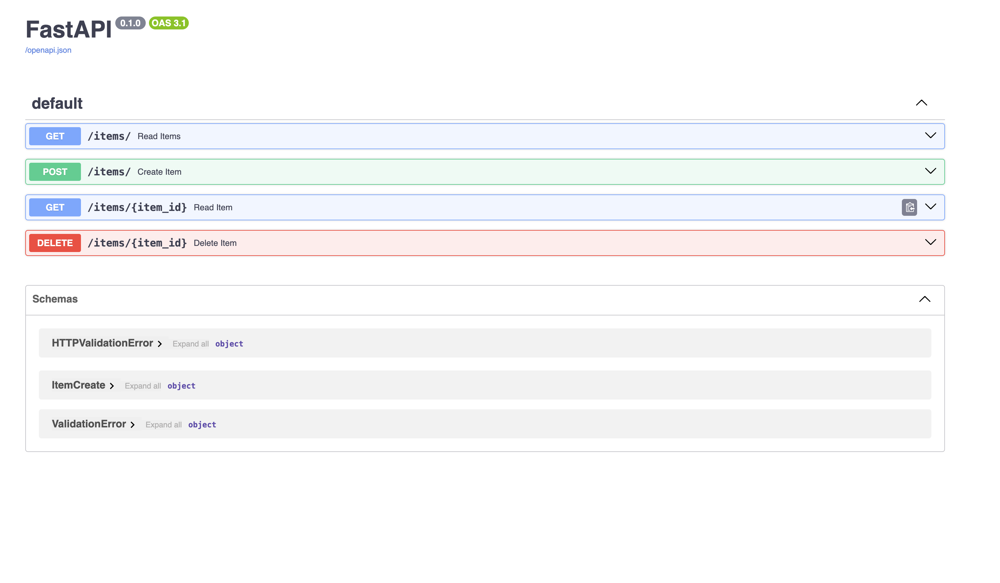

sqlite3 не смог установиться, потому что он встроен в стандарную библиотеку python :(

# 1. Запустил


# 2. Пути

```bash
$ http POST http://localhost:8000/items/ name="test" description="desc" body="test body"
HTTP/1.1 200 OK
content-length: 43
content-type: application/json
date: Fri, 25 Oct 2024 13:28:50 GMT
server: uvicorn

{
    "description": "desc",
    "id": 5,
    "name": "test"
}
```

```bash
$ http http://localhost:8000/items/

HTTP/1.1 200 OK
content-length: 260
content-type: application/json
date: Fri, 25 Oct 2024 13:28:09 GMT
server: uvicorn

[
    {
        "description": "Описание",
        "id": 1,
        "name": "Имя"
    },
    {
        "description": "2",
        "id": 2,
        "name": "1"
    },
    {
        "description": "Книга о мальчике который выжил",
        "id": 3,
        "name": "Гарри Поттер"
    },
    {
        "description": "string",
        "id": 4,
        "name": "string"
    }
]
```

```bash
$ http http://localhost:8000/items/5

HTTP/1.1 200 OK
content-length: 43
content-type: application/json
date: Fri, 25 Oct 2024 13:29:19 GMT
server: uvicorn

{
    "description": "desc",
    "id": 5,
    "name": "test"
}
```


```bash

$ http DELETE http://localhost:8000/items/5
HTTP/1.1 200 OK
content-length: 41
content-type: application/json
date: Fri, 25 Oct 2024 13:29:59 GMT
server: uvicorn

{
    "message": "Элемент удален"
}


$ http http://localhost:8000/items/5
HTTP/1.1 404 Not Found
content-length: 45
content-type: application/json
date: Fri, 25 Oct 2024 13:30:02 GMT
server: uvicorn

{
    "detail": "Элемент не найден"
}

```
